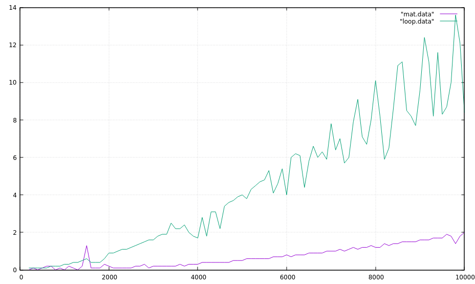

# Comparison between loop-fibnacci (O(n)) and matrx-fibnacci (O(ln(n)))



**How to run**
```
node fib/fib.js [compare|gnu-plot-data]
```

**compare**
```
node fib/fib.js compare
```
Output looks like:
```
_matFib(2000)=42246963333923048787... 3.4ms
loopFib(2000)=42246963333923048787... 2.8ms
_matFib(3000)=41061588630797126033... 2.3ms
loopFib(3000)=41061588630797126033... 2.2ms
_matFib(4000)=39909473435004422792... 0.9ms
loopFib(4000)=39909473435004422792... 3.7ms
_matFib(5000)=38789684543883256337... 1.6ms
loopFib(5000)=38789684543883256337... 4.7ms
_matFib(6000)=37701314938779994533... 1.2ms
loopFib(6000)=37701314938779994533... 5.1ms
_matFib(7000)=36643483050372328322... 1.4ms
loopFib(7000)=36643483050372328322... 8ms
_matFib(8000)=35615332044606267397... 2.8ms
loopFib(8000)=35615332044606267397... 9.8ms
_matFib(9000)=34616029128668474631... 2.4ms
loopFib(9000)=34616029128668474631... 9.4ms

```
It shows the two version for fibnacci nth value ant the time consumed to get the value.

As n get bigger , loop-time-consume get bigger fast then matrix-time-consume.

**gnu-plot-date**

This command is used to generate gnuplot drawable data (print into console)
```
node fib/fib.js gnu-plot-date --type <num-loop|num-matrix|big-num-loop|big-num-matrix >
```

I often use `big-num-loop` and `big-num-matrix` to create gnu date to void int overflow.

By the way,use pipe to save printed date to file in order to draw it later.
```
node fib/fib.js gnu-plot-date --type big-num-loop > fib/loop.data
node fib/fib.js gnu-plot-date --type big-num-matrix > fib/matrix.data
```

**plot**
```
gnuplot
plot "fib/loop.data" with lines,"fib/matrix.data" with lines
```